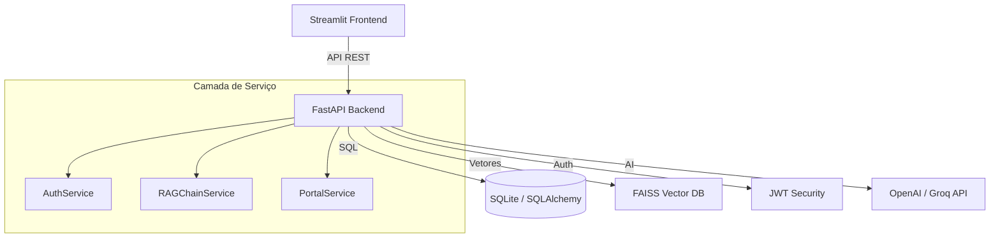

# 💎 JACN AI Portal - Enterprise Hub

O **JACN AI Portal** é uma plataforma corporativa avançada de inteligência artificial, projetada para processamento de linguagem natural (NLP), geração de conteúdo e recuperação de informações governada (RAG). Desenvolvido como uma solução SaaS multi-tenant, o portal permite que diferentes organizações gerenciem seus próprios usuários, documentos e histórico de forma totalmente isolada e segura.

## 🚀 Funcionalidades SaaS Premium

- **Prompt Hub (Geração de Conteúdo)**: Interface dedicada para interação com modelos de linguagem (LLMs) via OpenAI ou Groq. Cada usuário possui seu próprio histórico de gerações.
- **Intelligence Hub (RAG)**: Sistema de Recuperação Aumentada por Geração que permite "conversar" com seus próprios documentos PDF, com suporte a OCR para documentos digitalizados.
- **Visualização de Fontes**: Referências precisas aos documentos originais, indicando páginas e trechos utilizados na resposta.
- **Sistema de Feedback**: Possibilidade de avaliar as respostas da IA (👍/👎), auxiliando na melhoria contínua do sistema.
- **Isolamento Multi-tenant**: Separação física e lógica de diretórios de arquivos e dados no banco por Tenant e Usuário.
- **Design de Elite**: Interface moderna com glassmorphism, tipografia 'Plus Jakarta Sans' e UX otimizada para produtividade.
- **Dashboard & Analytics**: Monitoramento de métricas de uso, latência de API e status de planos/limites.

## 🏗️ Arquitetura Técnica

O sistema segue uma arquitetura cliente-servidor moderna:



### Stack Tecnológica
- **Frontend:** Streamlit (Python)
- **Backend:** FastAPI
- **Banco de Dados:** SQLite com SQLAlchemy ORM
- **Vetorização:** FAISS & Sentence-Transformers
- **Modelos:** OpenAI (GPT-4) & Groq (Llama-3)
- **Estilização:** Custom CSS (premium.css)

## 🛠️ Configuração e Instalação

### Pré-requisitos
- Python 3.9+
- Chaves de API (OpenAI ou Groq)

### Passo a Passo

1. **Clonar o Repositório:**
   ```bash
   git clone <repo-url>
   cd Streamlit_LLM
   ```

2. **Ambiente Virtual:**
   ```bash
   python -m venv venv
   .\venv\Scripts\Activate  # Windows
   source venv/bin/activate  # Linux/Mac
   ```

3. **Instalar Dependências:**
   ```bash
   pip install -r requirements.txt
   ```

4. **Variáveis de Ambiente:**
   Crie um arquivo `.env` na raiz:
   ```env
   OPENAI_API_KEY=sua_chave_aqui
   GROQ_API_KEY=sua_chave_aqui
   JWT_SECRET=seu_segredo_jwt
   ```

5. **Execução:**
   - **Backend:** `uvicorn main:app --reload`
   - **Frontend:** `streamlit run jacn_ai_portal.py`

---

## 📄 Licença
Este projeto é propriedade da **JACN AI**. Todos os direitos reservados.

**Desenvolvido por JACN AI Engineers.**
